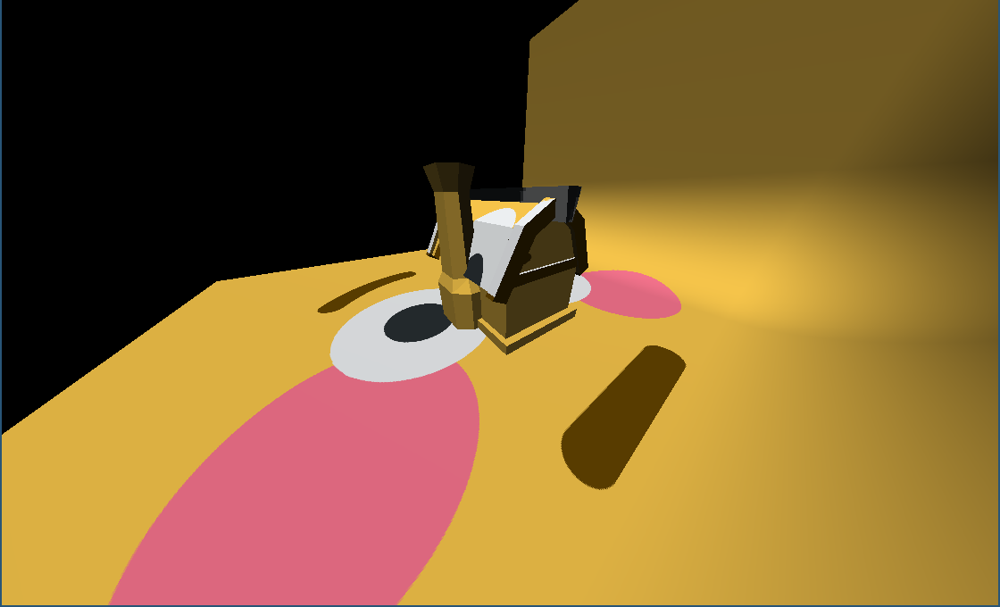

# gæm

Tiny experiment with modern OpenGL and C++20.



> Yes, that is a house with a :flushed: texture.

> Controls: LMB drag to rotate camera. Left/Right to switch meshes.

## Building

> Requirements:
> [glm](https://github.com/g-truc/glm),
> [glfw3](https://glfw.org),
> [ninja](https://ninja-build.org),
> [python ≥3.6](https://python.org),
> [clang ≥15](https://clang.llvm.org),
> [fmtlib](https://fmt.dev)

The project uses ninja with a custom python generator script as it's build system. The build configuration is stored in [`build.cfg`](/build.cfg) and is read by [`gen.py`](/gen.py) to generate the `build.ninja` file (note: it's in [`.gitignore`](/.gitignore)).

#### 0. Generate GL3W source and header files

This project uses [gl3w](https://github.com/skaslev/gl3w) as it's opengl loader. It requires a separate build process that can be done only *once*:

```bash
python gl3w_gen.py
```

#### 1. Generate the ninja files with gen.py

```bash
python gen.py
```

#### 2. Build the project with ninja

```bash
ninja
```

> Note: You can do both 1. and 2. at once:
> ```bash
> python gen.py && ninja
> ```

Ninja also provides some other useful commands:

```bash
# generate compilation database for clangd.
ninja -t compdb > compile_commands.json

# delete all the build files.
ninja -t clean
```

## Running

> Requirements: Support for OpenGL ≥4.5

Simply run the generated executable:

```bash
build/main
```

> Note: You can combine building and running into one command:
> ```bash
> python gen.py && ninja && build/main
> ```

## TODO

> Note: in order of importance.

- Add gltf loading support with cgltf.
- Add webgpu backend and backend system.
- Add Dear ImGui or something similar.
